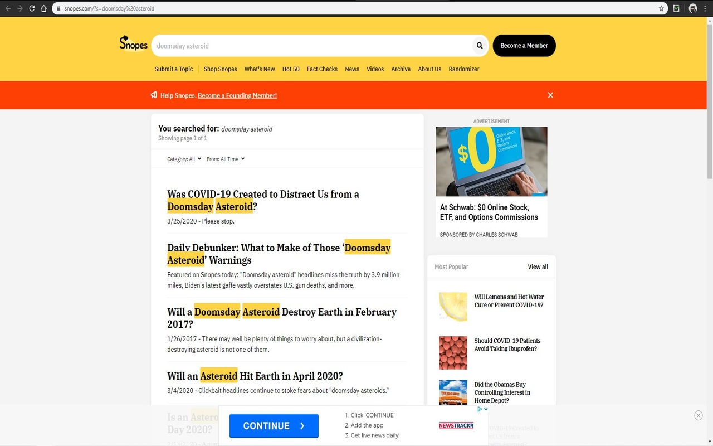

## CheckFact✅ (1.0.0)
A chrome extension that helps you validate dodgy internet claims through [Snopes](https://www.snopes.com/) with three easy steps:
1. Use mouse to select dodgy internet claim

2. Right click on highlighted text and click on "Search Snopes for..."

3. Check validity of said claim on redirected Snopes page

Contrarily, you can directly enter custom keywords into the search text-box in the popup:

#### Disclaimer:
CheckFact✅ and the author are not affiliated with [Snopes](https://www.snopes.com/) in any way, shape or form.

### Changelog:
(1.0.1)
- Added search text box in popup to search Snopes with custom keywords

(1.0.2/1.0.3)
- Remove screenshots from source code to make app more lightweight